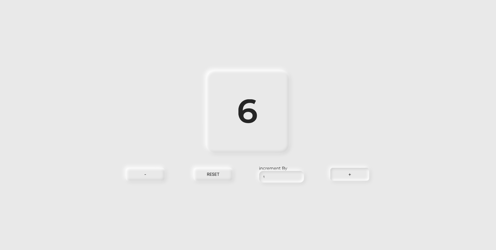

[![Stargazers][stars-shield]][stars-url]
[![Issues][issues-shield]][issues-url]
[![MIT License][license-shield]][license-url]
[![LinkedIn][linkedin-shield]][linkedin-url]


<section id="readme-top">
<!-- PROJECT LOGO -->
<br />
<div align="center" id="readme-top">
  <a href="https://github.com/Arm0ny/jsAwesomeCounter">
    
  </a>

<h3 align="center">Awesome Counter</h3>

  <p align="center">
    a simple but designer counter you can use to make your counts look beautiful
    <br/>
    <a href="https://jsawesomecounter.web.app">Try It Out</a>
    <br/>
    <a href="https://github.com/Arm0ny/jsAwesomeCounter/issues">Report Bug</a>
    <a href="https://github.com/Arm0ny/jsAwesomeCounter/issues">Request Feature</a>
  </p>
</div>


<!-- TABLE OF CONTENTS -->
<details>
  <summary>Table of Contents</summary>
  <ol>
    <li>
      <a href="#about-the-project">About The Project</a>
      <ul>
        <li><a href="#built-with">Built With</a></li>
      </ul>
    </li>
    <li>
      <a href="#getting-started">Getting Started</a>
      <ul>
        <li><a href="#prerequisites">Prerequisites</a></li>
        <li><a href="#installation">Installation</a></li>
      </ul>
    </li>
    <li><a href="#usage">Usage</a></li>
    <li><a href="#roadmap">Roadmap</a></li>
    <li><a href="#contributing">Contributing</a></li>
    <li><a href="#license">License</a></li>
    <li><a href="#contact">Contact</a></li>
    <li><a href="#acknowledgments">Acknowledgments</a></li>
  </ol>
</details>

</section>


<!-- ABOUT THE PROJECT -->

<section id="about-the-project">

## About The Project

[![Product Name Screen Shot][product-screenshot]](https://example.com)

the app serves as a simple counter you can use as it is or customize buttons and functionalities
through the code
</section>

<p align="right">(<a href="#readme-top">back to top</a>)</p>


<section id="built-with">

### Built With

* ![javascript][javascript_img]
* ![html_img][html_img]
* ![css_img][css_img]
</section>

<p align="right">(<a href="#readme-top">back to top</a>)</p>


<!-- GETTING STARTED -->
<section id="getting-started">
## Getting Started
.

### Prerequisites

this is a vanilla javascript project, so you won't need anything else then a browser to run it

### Installation
   ```sh
   git clone https://github.com/Arm0ny/Books.git
   ```
<p align="right">(<a href="#readme-top">back to top</a>)</p>
</section>


<!-- USAGE EXAMPLES -->
<section id="usage">

## Usage

### Using the vanilla counter

if you want to use the counter as it is simply set an increment on the input labeled "increment By" or leave it
as is, and start pressing the "+" and "-" buttons to modify the value of the counter<br/>


<br/>
<br/>

### Adding Custom Buttons

if you want to add your custom buttons you need to modify the /js/counter.js file in the following way
<ul>
<li>

**_Step 1_** `createButton()`

<br>

you can create buttons with the **createButton(parent, buttonText, action)** function that takes as inputs: 

<br>

1. **the parent div**: is the div in which to attach the button under (can be counterMain or controls)
2. **the buttonText**: is the content displayed into the button, it's actual innerHTML, so you can specify images, text and other stuff
3. **the action**: Must be unique, it is the actual action performed by the button you will define it later in the `updateCounter()` function

<br/>

in the example below WE've created a new button, attached it to the "controls", gave it a text of "MUL" an action of "multiply"

<br>


</li>
<br/>
<br/>

<li>

**_Step 2_** **Configuring actions**

<br>

To make our button actually functional we need to configure an **action** into the `updateCounter()` function
to do this, simply add a `case 'yourAction:` to the main switch and complete it with the functionality you want to implement

**N. B. the `myAction` value must match a button's action value**

<br>

In the example below we configured the action for the button we created in step one, so we added a `case: 'multiply'`
to the main switch;
to get the counter value we used an apposite function called `getCounterValue()` and then converted the result of the operation into string
to match the **innerHTML** setter value

<br/>


</li>

</ul>
<br/>
<br/>
<br/>
Et voilà we've successfully added our MUL button, we can now multiply the counter's value with the value specified into the case

<br>
<br>


<br/>

<p align="right">(<a href="#readme-top">back to top</a>)</p>
</section>


<!-- CONTRIBUTING -->
<section id="contributing">

## Contributing

Contributions are what make the open source community such an amazing place to learn, inspire, and create. Any contributions you make are **greatly appreciated**.

If you have a suggestion that would make this better, please fork the repo and create a pull request. You can also simply open an issue with the tag "enhancement".
Don't forget to give the project a star! Thanks again!

1. Fork the Project
2. Create your Feature Branch (`git checkout -b feature/AmazingFeature`)
3. Commit your Changes (`git commit -m 'Add some AmazingFeature'`)
4. Push to the Branch (`git push origin feature/AmazingFeature`)
5. Open a Pull Request

</section>

<p align="right">(<a href="#readme-top">back to top</a>)</p>


<!-- LICENSE -->
<section id="license">

## License

Distributed under the MIT License. See `LICENSE.txt` for more information.

<p align="right">(<a href="#readme-top">back to top</a>)</p>

</section>

<!-- CONTACT -->

<section id="contact">

## Contact

Your Name - armando.pagano2001@gmail.com

Project Link: [https://github.com/Arm0ny/jsAwesomeCounter](https://github.com/Arm0ny/jsAwesomeCounter)

<p align="right">(<a href="#readme-top">back to top</a>)</p>
</section>


<!-- MARKDOWN LINKS & IMAGES -->
<!-- https://www.markdownguide.org/basic-syntax/#reference-style-links -->
[stars-shield]: https://img.shields.io/github/stars/Arm0ny/jsAwesomeCounter.svg?style=for-the-badge
[stars-url]: https://github.com/Arm0ny/Books/stargazers
[issues-shield]: https://img.shields.io/github/issues/Arm0ny/jsAwesomeCounter.svg?style=for-the-badge
[issues-url]: https://github.com/github_username/repo_name/issues
[license-shield]: https://img.shields.io/github/license/Arm0ny/jsAwesomeCounter.svg?style=for-the-badge
[license-url]: https://github.com/Arm0ny/Books/blob/master/LICENSE.txt
[linkedin-shield]: https://img.shields.io/badge/-LinkedIn-black.svg?style=for-the-badge&logo=linkedin&colorB=555
[linkedin-url]: https://www.linkedin.com/in/armando-pagano-67787916a
[product-screenshot]: img/product_about_screenshot.png
[Next.js]: https://img.shields.io/badge/next.js-000000?style=for-the-badge&logo=nextdotjs&logoColor=white
[Next-url]: https://nextjs.org/
[React.js]: https://img.shields.io/badge/React-20232A?style=for-the-badge&logo=react&logoColor=61DAFB
[React-url]: https://reactjs.org/
[Vue.js]: https://img.shields.io/badge/Vue.js-35495E?style=for-the-badge&logo=vuedotjs&logoColor=4FC08D
[Vue-url]: https://vuejs.org/
[Angular.io]: https://img.shields.io/badge/Angular-DD0031?style=for-the-badge&logo=angular&logoColor=white
[Angular-url]: https://angular.io/
[Svelte.dev]: https://img.shields.io/badge/Svelte-4A4A55?style=for-the-badge&logo=svelte&logoColor=FF3E00
[Svelte-url]: https://svelte.dev/
[Laravel.com]: https://img.shields.io/badge/Laravel-FF2D20?style=for-the-badge&logo=laravel&logoColor=white
[Laravel-url]: https://laravel.com
[Bootstrap.com]: https://img.shields.io/badge/Bootstrap-563D7C?style=for-the-badge&logo=bootstrap&logoColor=white
[Bootstrap-url]: https://getbootstrap.com
[JQuery.com]: https://img.shields.io/badge/jQuery-0769AD?style=for-the-badge&logo=jquery&logoColor=white
[JQuery-url]: https://jquery.com 
[javascript_img]: https://img.shields.io/badge/-javascript-black?style=for-the-badge&logo=javascript
[html_img]: https://img.shields.io/badge/-HTML5-DD0031?style=for-the-badge&logo=html5
[css_img]: https://img.shields.io/badge/-CSS3-0769AD?style=for-the-badge&logo=css3

